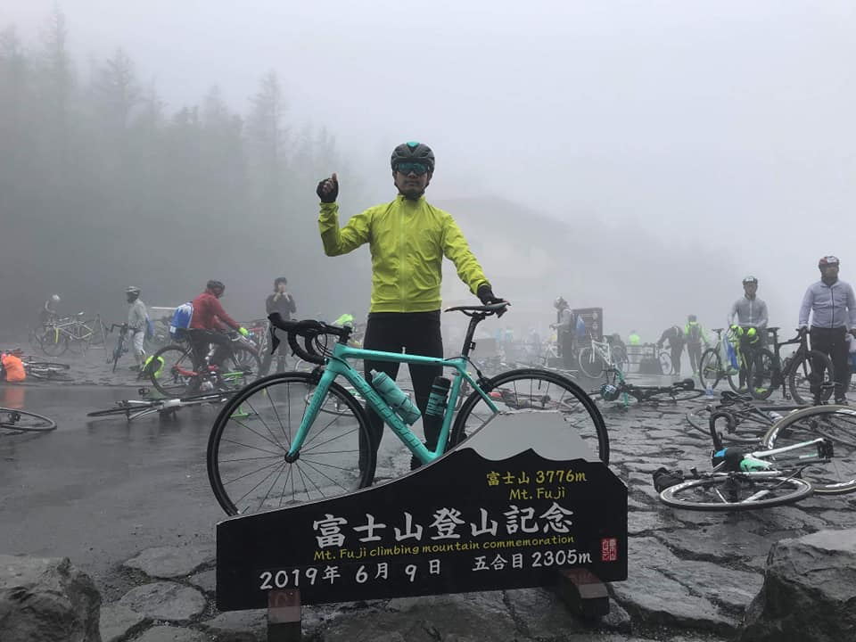
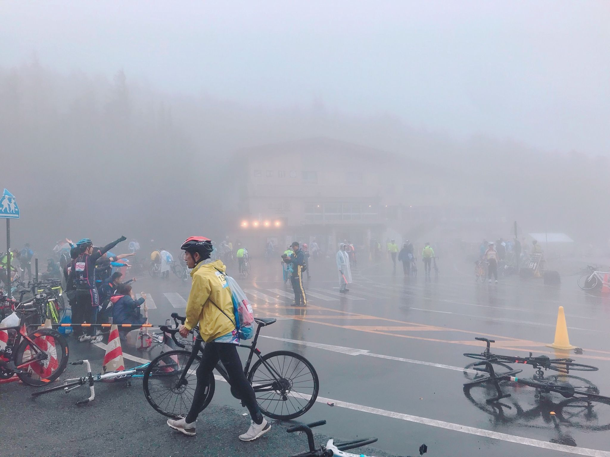

每年一次的日本單車旅遊，在同事的慫恿下

這次來體驗看看日本當地的單車挑戰賽

也是台灣車友去日本比賽一定會參加的挑戰賽- Mt.富士ヒルクライム

話說...太久沒來更新網誌，發現原本的的圖床已經結束營業收掉了...  
圖片完全沒有備份...幫ＱＱ,懶得重寫...乾脆砍掉文章  
然後git另開分支重寫Blog

<!--truncate-->
由於之前有環過日本四國，關西地區包含琵琶湖一周(抱歉文章已砍,懶得重寫)

所以帶車去日本騎車的經驗已經算是非常豐富（吹噓貌）

這次因為要參加比賽不是屬於長途旅行，又是第一次帶小綠去日本

所以這次選擇租用單車航空箱，畢竟高價單車碰傷划不來（碰傷大概也沒心情繼續旅程了）

大概就這麼大

車子裝箱後還有空間順便塞了打氣筒跟車衣車褲還有維修工具

接下來帶去機場，一如往常沒過Ｘ光機（但日本的會過）就上拖車了

經過約莫3小時的飛行，人生第二次來到東京成田機場（是的我第二次來東京）

本來要直接搭ＪＲ去新宿，後來看到訊息說山手線發生人身事故...只好轉其他交通工具

在第二航廈有直達新宿的巴士（3300円/片道）,單程可以吃食べ放題了...

是說一下飛機就一直下雨，到了新宿也是天氣不美麗

隨手查了食べログ..發現附近有一間分數還不錯高的拉麵

はやし田らぁ麺

真的好吃啦！！

隔天直接到新宿站搭富士急行的バス

直達河口湖

運氣蠻好，碰到可以塞單車箱的車子，不然聽聞以前的車友常常上不了

抵達河口湖後，還要再拖著笨重的單車箱走2公里到今晚入宿的旅館...

旅館是中國人開的，因為現在是河口湖的旺季，真的沒有半年前訂房根本訂不到

感謝這次跟我同行的同事-馬克有訂到這間（雖然走得遠了點）

不然就要睡車站了

旅館是傳統和室，たたみ的藺草味很濃很香

行李安置好後下去前庭，旅館主人同意讓我們在這邊組單車

組完後準備去會場拿取明天富士山挑戰賽的物資以及號碼布

享受一下這短暫的陽光（因為之後幾天在下雨...）

旅館距離會場大概10公里，爬升約300公尺

會場在富士山的山腳下

到現場已經人山人海了

大家車子隨便靠著就去拿物資了

隨便幾台都10萬以上的名車啊...

真不愧是日本人！！

當然也有幾個台灣人組團來比賽

領了號碼布，這數字不錯！！

行李送上下山專用袋，你可以騎車時先把外套等行李放裡面

到山頂的時候統一領取（因為今年山頂真的冷）

會場根本就是單車界大拜拜

拿完物資後天氣還不錯，把握現在的好天氣去繞繞河口湖

來到富士御室浅間神社祈禱明天騎乘順利

順便求了御朱印

拜完後就逆時針環湖啦！為什麼要逆時針？

因為日本道路靠左行駛，逆時針會離湖比較近

到了河口湖著名拍攝逆富士的景

但運氣很不好，富士山被厚厚的雲遮住

其實我這輩子還沒看過富士山的本尊...

不然這個點可以看到富士山時應該是長這樣（取自google街景） 

陽光灑下來,其實我比較期待雲散開可以看見富士山

好吧！看不到就是看不到...

晚餐也不知要吃啥，可能是觀光區的關係

東西都靠杯貴！！

只好隨便找間連鎖店來吃

車子停好，剛好遇到一個阿杯台灣人迷路

不會日文的阿杯聽到我們停車時講中文就好像遇到救星

他手機快沒電又與團員失聯

還好同事馬克隨身攜帶充電尿袋應應急順便幫他找他住宿的旅館怎麼走

阿杯為了答謝我們請我們吃晚餐

我也不客氣點了很多（我真的好意思！）

吃完後我只能說阿杯你真好，你一定會順利找到回去的路的！！

然後明天開心完賽

真的吃得很澎湃就是了XD

吃完回旅館順便去超市帶了一盒宵夜，但手腳太慢搶不到半額

此時晚上的河口湖突然開始下起雨來

只好祈禱明天比賽能夠好天氣

但通常會有這種想法

老天爺就會給你下到不要不要的

天剛亮...旅館隔壁幾間似乎也是車友

早早就出門了！

往外看看路面

果然我心中的老天爺沒讓我失望

地是濕的....但沒下雨

很好！就趁這段空擋趕快殺到比賽會場

到了會場發現其實我們算很晚到了

連上山行李巴士都已經開上山去了...

其實自己簡章也沒仔細看清楚行李配送時間...怨不得人...

開賽前開始下起雨來，氣溫也變低很多

其實一直搞不懂為何這個比賽要辦在日本的梅雨季呢？

表定7:30出發，由於出發人數眾多（聽聞有1萬人）

我被安排在第19梯次出發，差不多8:30才輪到我們

話說我同事馬克的梯次比較前面早我30分鐘出發

其實等到出發的時候身體已經完全冷掉了

終於輪到我們出發了

富士山挑戰賽

起點由富士北麓公園陸上競技場，到終點富士山五合目（標高2305m）

全長23.4km,總爬升1200m,以難度來說大概就是台灣宜蘭的太平山差不多

環法坡度等級是最高級的ＨＣ級

全程除了補給加水之外就沒有落地了（所以就沒有騎乘過程的照片了）

是說天候惡劣整路起霧下雨根本看不到什麼景色就是了

好不容易在這惡劣又低溫的天候終於騎上終點富士五合目

上面的溫度只有9度，因為下雨又大風體感溫度大概3~4度吧

到終點後雨下更大了

  
吃個冰淇淋壓壓驚

有點後悔沒來這個神社蓋朱印

又一個人生清單達成！

在附近賣店吃完東西後就趕緊下山了

不然山上雨跟霧越來越大，溫度也越來越低

下山可以選擇接駁下山或是自己騎下山

下山也是分梯次，然後下山真的靠杯冷....(後悔沒搭接駁車)

回到山腳的起點會有熱烏龍麵（但我沒看到）

因為我急忙去服務台辦理證明想說早點回去洗澡

完賽證明的部分

有完賽的人會有一個金屬的龍頭墊圈（單車的一個零件）

沒有獎牌只有完賽證明

然後那個龍頭墊圈有分

金環：65分鐘內完賽  
銀環：75分鐘內完賽  
銅環：90分鐘內完賽  
藍環：男子組完賽  
粉環：女子組完賽  

本廢物騎了141分鐘...只能領藍環

大會還說歷年完賽率是99% (我開始懷疑這個說法了...)

算了！我本來就是來輕鬆騎的

這次挑戰的路線（上山+下山）

<iframe height='405' width='590' frameborder='0' allowtransparency='true' scrolling='no' src='https://www.strava.com/activities/2435246405/embed/5237a9b224bb00a0d3aa3625acedcb90dc693fe0'></iframe>

Relive影片-我是不知道那個最高速123km/h怎麼來的XD

<blockquote class="embedly-card" data-card-controls="0" data-card-key="f1631a41cb254ca5b035dc5747a5bd75"><h4><a href="https://www.relive.cc/view/vKv244Rxk46?r=embed-site">Relive '富士山ヒルクライム'</a></h4></blockquote>

另外必須補充很重要的一點

Mt.富士ヒルクライム這個挑戰賽全程的補給只有"水"

Mt.富士ヒルクライム這個挑戰賽全程的補給只有"水"

Mt.富士ヒルクライム這個挑戰賽全程的補給只有"水"

很重要,講三遍!

沒錯就只有水，沒有其他任何補給，簡章上也沒寫，所以基本上我騎到四合目時就沒力了

因為我沒帶補給品，早餐只吃一個菠蘿跟一杯咖啡就上了

然後因為比較晚出發的關係

爬到一半已經有人下滑了

而且又差點被別人亂丟的水壺拌倒

有在騎車的人應該知道這種心情會很差

雖然知道在國外騎車不能跟台灣本地賽事做比較

但老實說Mt.富士ヒルクライム在這方面做得並不好

也必須強調不是日本人辦的活動就一定很好

我同事也是因為沒有補給騎到四合目直接進餐廳飽餐一頓再上山

下山後回到旅館，整個騎的很狼狽

還好我是帶鋁合金輪組來（不然這種惡劣天氣下坡用碳纖維輪組很傷）

辛苦了我的小綠！！

回到旅館沒事就先把車拆一拆裝回車箱

準備明天回到東京

然後在這邊感謝在旅館打工的當地住民-山中先生

請他載我們跟車箱運到車站（我可不想在雨中拖著車箱走到車站）

回程途中，山中先生說我們運氣很差，剛好來的這幾天都在下雨

  
果然也一堆人擠在河口湖站

雨天哪也去不了

一樣也是搭富士急行的バス回到新宿

回到新宿依然在下雨

趕緊到入住的旅館放行李

房間一個人住很可以

因為算是蠻常來日本的其實也沒什麼購物行程

就隨便逛逛

去神社參拜蓋個朱印

晚上最後一餐就用新宿拉麵名店-風雲兒做為結束！！！

然後人生最漚就是

隔天要回台灣天氣才放晴

.....感覺是嘲笑我傻啊.....

這趟旅行又達成了一個成就

來到富士山，爬上富士山，但卻沒看過富士山

看來我真的沒緣份呢！

