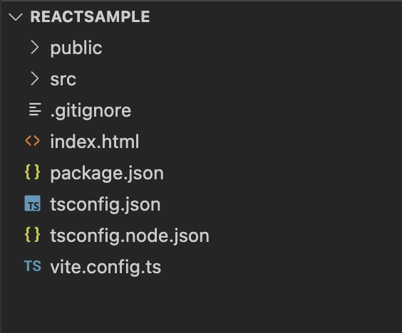

測試寫一個搭配vite的react專案模板

<!--truncate-->

## Install vite/react/typescript
按照官網起手式

``` bash
$ yarn create vite
```
安裝過程中會問你

1. 專案名稱,名稱就先叫reactSample吧
2. 要搭配哪個前端框架
3. 要選用js還是ts


如果你不想那麼囉唆也可以下以下指令

```bash
$ yarn create vite reactSample --template react-ts
```

之後會建構一個名為reactSample的資料夾，資料夾結構如下



看得出來還沒安裝依賴的node_modules

裝一下(記得要先進到剛剛創建好的reactSample目錄裡)

```bash
$ cd reactSample && yarn install
```
恩！

到目前為止vite/react/typescript都已經裝好了

接下來裝開發時需要的靜態檢查工具

## Install Eslint

靜態檢查工具可以在開發階段就先檢測出你的程式碼是否有簡單邏輯或是格式甚至於拼字上的錯誤

typescript有tslint的靜態檢查工具, 但功能跟eslint大同小異

後來靜態檢查功能就跟eslint合併然後tslint就被棄用了（幫QQ）

那我們來裝eslint吧

```bash
$ yarn add -D eslint
```
配置初始設定文件檔

```bash
$ npx eslint --init
```
過程中過程中安裝小幫手會問幾個選項


選第二項<code>To check syntax and find problems</code>

我們晚點會使用prettier來強制執行這個設定


我們用react+typescript那當然就是選第一個囉


這邊會問你以下這些依賴套件要一起安裝,你是否要一起安裝？

但因為這邊安裝的套件是使用NPM,我們使用的是yarn,所以先選擇<code>NO</code>

改用下面yarn的寫法
```bash
$ yarn add -D eslint-plugin-react@latest @typescript-eslint/eslint-plugin@latest @typescript-eslint/parser@latest
```
基本上你的基礎eslint設定檔已經建出來了


對了！在上面小幫手設定過程中他會問你設定檔要用什麼格式,可以自己習慣用什麼格式而定

我這邊是用<code>json</code>, 所以產出一個<code>.eslintrc.json</code>的檔案

接著安裝一些依賴套件讓eslint跟typescript關聯

```bash
$ yarn add -D eslint-plugin-import @typescript-eslint/parser eslint-import-resolver-typescript
```

## Install Prettier

Prettier是一個程式碼格式化的套件

本身並不像Eslint去執行靜態檢查

我們code寫久了常常縮排跑掉或是括號少個空格等等

尤其是團隊寫code時大家寫的風格不一樣,看起來就很難閱讀

所以有個可以統一風格的工具是很重要的

所以廢話不多說

直接安裝相關的套件

```bash
$ yarn add -D prettier eslint-config-prettier eslint-plugin- prettier eslint-plugin-react-hooks
```

裝完後新增一個空白的prettier設定檔<code>.prettierrc</code>

```bash
$ touch .prettierrc
```

如下圖


再來是vscode也要安裝相關插件,這樣有錯誤時才會幫你高亮出來ＸＤ

插件百百種

我自己是用星星數最多的拉


裝完啟用後應該在資訊列會有prettier的圖示選項


## eslintrc setting

創建完<code>.prettierrc</code>後可以來設定eslintrc擴充部分

在extends部分添加prettier


關於eslint的rules的部分

通常是根據團隊的習慣自己去制定

[可以參考相關eslint的規則](https://eslint.org/docs/latest/rules/)

在plugin的部分也記得要添加prettier相關的插件


最後一個設定是設定typescript的import解析器


這樣就差不多設定完了

可以來測試一下

我們在<code>package.json</code>的script增加幾個指令


設定完後

隨便在任何一隻檔案裡面添加一個明顯不會通過規則的錯誤

例如我在App.tsx新增一個<code>let a= 0</code>


其實在寫的當下編輯器已經出現紅色毛毛蟲警告你這邊會有問題了

但這邊先不理他

接著我們打指令

```bash
$ yarn run lint
```

這時eslint就會告訴你哪個檔案哪一行的程式碼沒有通過驗證


當然eslint也會提示你可以使用<code>--fix</code>參數

來自動幫你修正錯誤

可以試著執行剛剛在package.json裡的script另外新增的<code>lint:fix</code>

```bash
$ yarn run lint:fix
```
會發現eslint會幫你根據規則把錯誤修復


但原則上這功能還是少用, 因為還是自己手動看錯誤自己改才比較踏實

## eslintignore

這時候還能再另外設定哪些檔案不想被檢查

可以另外創建<code>.eslintignore</code>

```bash
$ touch .eslintignore
```
像是如果剛剛的App.tsx不想被檢查的話

可以直接寫


這樣eslint就會略過不檢查這個檔案

## prettier setting

prettier設定的部分

可以根據團隊使用習慣在<code>.prettierrc</code>加上規則

規則的部分可以參考官網:[點我](https://prettier.io/playground/)

我自己的設定是這樣拉

```json
{
  "semi": true,
  "tabWidth": 4,
  "printWidth": 100,
  "singleQuote": true,
  "trailingComma": "all",
  "jsxSingleQuote": true,
  "bracketSpacing": true
}
```

接下來做測試

隨便拿個檔案這次找<code>main.tsx</code>

刻意把裡面的格式打亂然後縮排亂凸


這時候按下鍵盤<code>shift</code>+<code>alt</code>+<code>F</code>

macOS請用<code>⇧Shift</code>+<code>⌥Option</code>+<code>F</code>


你會看到prettier幫你把縮排縮好,遺失的句尾分號也補上去了

## 製作範本
使用[degit](https://github.com/Rich-Harris/degit)這樣的工具

只要github上的repo都可以當成範本,當然其他的gitlab之類的repo也可

以往我們可能會用clone來搭建項目的範本,但往往我們不需要它裡面的git紀錄

現在可以很單純的使用degit來拉我們想的範本快速搭建專案骨架

使用方法

```bash
$ npx degit [template repository]#[branch|tag|commit hash] [your_new_proj]
```
＃號後面接的可以是分支名或tag或commit

不寫的話預設是master | main 分支

例如我剛剛推上去的reactSample就可以當成template

可以寫成

```bash
$ npx degit sayaku/reactSample new_react_project
```

或是網址

```bash
$ npx degit https://github.com/sayaku/reactSample new_react_project
```
這樣就可以快速把我原本寫好的範本拿來開新的專案了

其實我這篇寫了這麼多

在社群裡面早就有人寫了很實用的template可以直接當專案範本了

可以參考[Awesome Vite.js](https://github.com/vitejs/awesome-vite#templates)


##Refs
[vite](https://vitejs.dev/)
[ESLint + Prettier + Typescript and React in 2022](https://blog.devgenius.io/eslint-prettier-typescript-and-react-in-2022-e5021ebca2b1)
[Awesome Vite.js](https://github.com/vitejs/awesome-vite#templates)