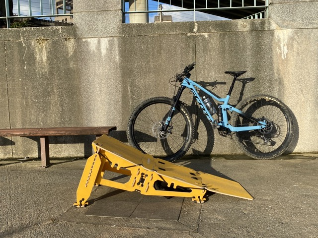

網路上看到這個有趣的產品- MTB HOPPER

簡單來說就是個可以簡易組合拆裝方便攜帶的行動跳台

實際操作網路上搜尋MTB HOPPER應該會有一堆範例影片

這邊主要紀錄他怎麼組合與收納
<!--truncate-->
## Unboxing / Assembly
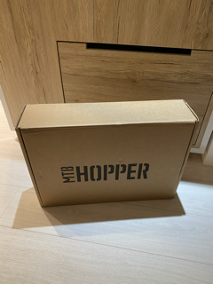

送來時就是個簡單的紙箱

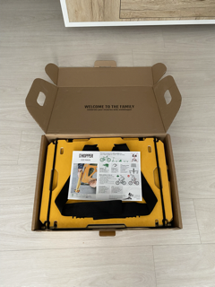

開箱內容就是一張很簡單的說明書

內容官網有一份pdf可供[下載](https://cdn.shopify.com/s/files/1/2484/8112/files/LITE.pdf?v=1613927342)

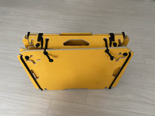

拿出來就像一個小公事包

重量約五公斤

另一面有雙肩背帶

騎MTB背個5KG應該沒啥問題

公事包打開後會有這些零件

基本上非常好組

不用看說明書慢慢摸索都知道怎麼組

零件上面也有對應接合的編號

按照號碼接起來基本上不會接錯

接好以後就是個跳台的樣子

這個跳台可以調高度

最低的高度就是長這個樣子

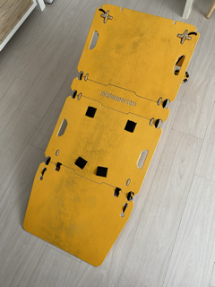

這樣看好像還好

等你真的騎上車往跳台看過去會覺得

媽呀這好像有點高有點陡

我承認第一次跳真的要克服恐懼

什麼跳台要領: 平衡, 蹲低, 起跳

早就忘了...

記得重心不要往前面，不然起跳後腳會被彈飛（第一次跳台不知道就是這樣飛出去的）

所以才買這個產品來練跳台

起跳時重心會在後輪上, 屁股位置應該會在後輪軸心的正上方（官網建議的）

多跳幾次好像就抓到要領了

<iframe width="320" height="560" src="https://www.youtube.com/embed/OtP-bDZb22Q" title="November 16, 2022" frameborder="0" allow="accelerometer; autoplay; clipboard-write; encrypted-media; gyroscope; picture-in-picture" allowfullscreen></iframe>

慢動作

<iframe width="320" height="560" src="https://www.youtube.com/embed/Iv9SkHC57vo" title="November 16, 2022" frameborder="0" allow="accelerometer; autoplay; clipboard-write; encrypted-media; gyroscope; picture-in-picture" allowfullscreen></iframe>

## Disassembly / Fold

其實會裝就會拆

問題是拆了以後我忘記當初是怎麼放的

這邊記錄一下

中間兩片支架放最下面

然後兩個側腳折起來交疊

最後是正面可調高度的大腳放最上面

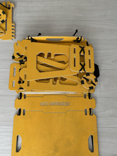

這樣就可以完整收合

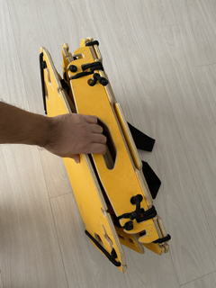

那要怎麼固定收合呢？

當初這邊卡關卡超久

原來是上方那一條繩子拉到那個洞洞卡住就完成固定了

看下面分解圖

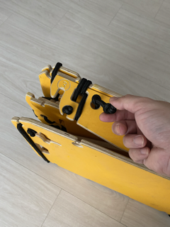

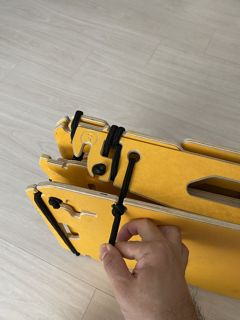

兩邊都做一樣的動作

這樣就完成固定了

完成！！這是有雙肩背帶的那一面

一樣也是可以調背帶鬆緊

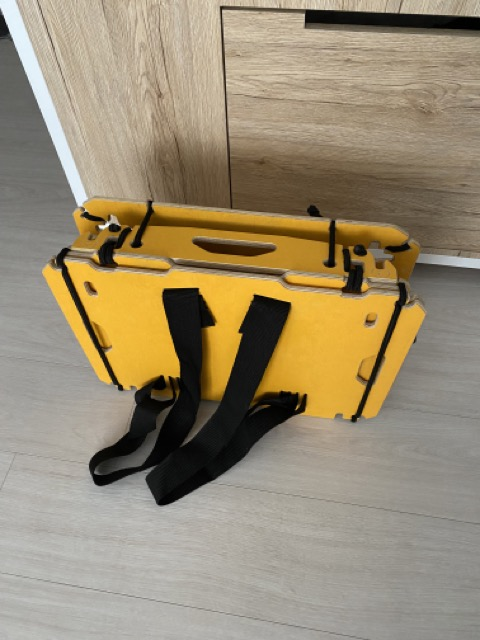

這個跳台整體來說真的設計得很棒

可攜式跳台真是一大誘因

背著騎到哪就能組跳台玩飛跳

youtube上有展示此跳台的很多應用

有看到拿去玩街攀的各種誇張技巧

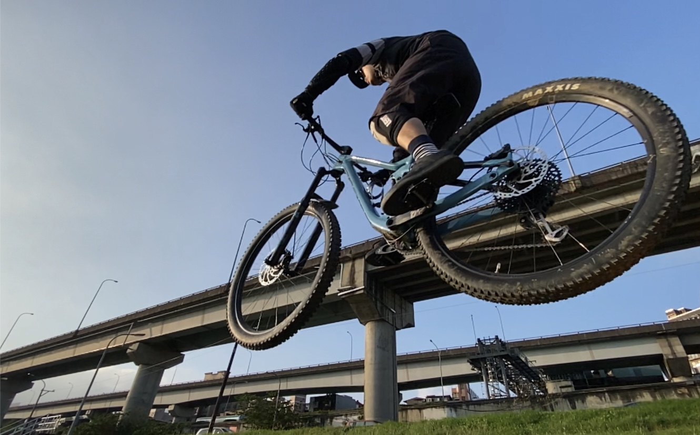

