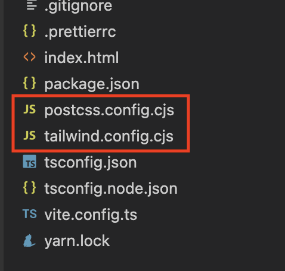
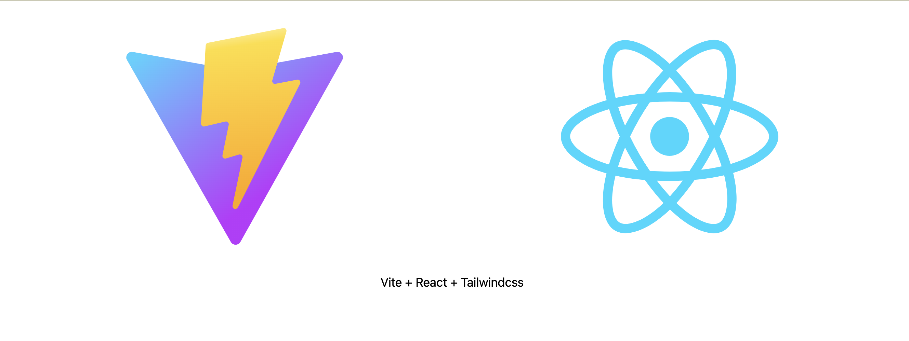
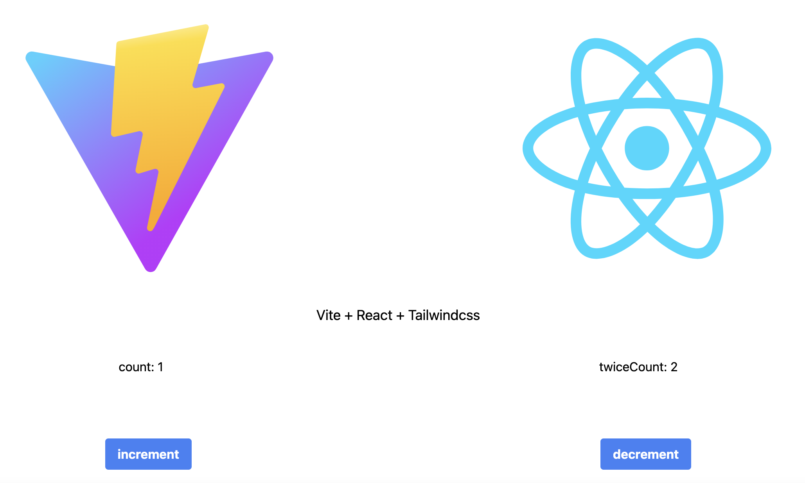

繼上一次[vite-react範本設定](/blog/2022/11/08/build-project-react-with-vite)

這次要來擴充這個範本

作成我工作上習慣的配置環境

<!--truncate-->

## extension
+ sass / tailwindcss 3 / postcss
+ rxjs / observable-hooks
+ redux-toolkit / redux-observable
+ husky
+ axios-observable

首先拉上一次建好的範本再另外做一個擴充版本的範本

```bash
$ npx degit sayaku/reactSample viteReactTemplate
```

下載後進到資料夾

```bash
$ cd viteReactTemplate
```

## install sass / tailwindcss 3 / postcss

首先安裝跟tailwindcss相關的依賴

```bash
$ yarn add sass tailwindcss postcss autoprefixer --dev
```

裝完後初始化tailwindcss與postcss的設定檔

```bash
$ npx tailwindcss init -p
```
這時目錄下會多兩個設定檔<code>postcss.config.cjs</code>, <code>tailwindcss.config.cjs</code>出來



兩個檔案需要變動如下

import Tabs from '@theme/Tabs';
import TabItem from '@theme/TabItem';

<Tabs>
<TabItem value="postcss.config" label="postcss.config.cjs">

```js
module.exports= {
  plugins: {
    tailwindcss: {},
    autoprefixer: {},
  },
}

```

</TabItem>

<TabItem value="tailwindcss.config" label="tailwindcss.config.cjs">

```js {2-5}
module.exports= {
  mode: "jit", // 開啟jit模式可以用自訂數字來定義寬高或間距
  content: [
    "./index.html",
    "./src/**/*.{js,ts,jsx,tsx}",
  ],
  theme: {
    extend: {},
  },
  plugins: [],
}

```

</TabItem>
</Tabs>

vite預設會去找有沒有符合postcss-load-config的檔案並且去套用它

符合postcss-load-config檔名與副檔名可參考:[這裡](https://github.com/postcss/postcss-load-config#postcssrcjs-or-postcssconfigjs)

postcss的config裡關於tailwindcss如果沒特別設定,預設會去抓<code>tailwindcss.config</code>

也就是我們把vite給run起來的時候就會一起去跑postcss與tailwindcss的設定了

vite設定真的少很多（望向webpack還要寫一堆loader...）

預處理css的部分

vite預設有支援sass, 不用另外像webpack來裝sass的loader, 但vite要另外裝sass的依賴（所以我們上面先裝過sass了）

就算你不用sass, vite也預設支援<code>postcss-import</code>與<code>postcss-nesting</code>

讓你可以在css上import其他css以及在css裡面像sass那樣能寫巢狀css

這邊我們先去引入基本的tailwindcss

然後在<code>App.tsx</code>做一些class的修改(套用tailwindcss class)

<Tabs>
<TabItem value="tailwind" label="/src/style/tailwind.scss">

```css
@tailwind base;
@tailwind components;
@tailwind utilities;
```

</TabItem>

<TabItem value="index" label="src/index.scss">

```css
@import 'style/tailwind';

```

</TabItem>

<TabItem value="app" label="src/App.tsx">

```tsx {7-19}
import { useState } from "react";
import reactLogo from "./assets/react.svg";

function App() {
  const [count, setCount] = useState(0);

  return (
    <div className="flex flex-col">
      <div className="w-full flex justify-around p-10">
        <a href="https://vitejs.dev" target="_blank" className="basis-1/4">
          
        </a>
        <a href="https://reactjs.org" target="_blank" className="basis-1/4">
          
        </a>
      </div>
      <h1 className="self-center text-lg mx-5">Vite + React + Tailwindcss</h1>
    </div>
  );
}

export default App;

```

</TabItem>
</Tabs>

接下來正式跑一下

```bash
$ yarn run dev
```

跑起來發現我們的tailwindcss都套用上去了



到這邊基本的style的部分都設定好了

## rxjs / observable-hooks

雖然簡單的非同步用Promise/async/await即可達成

但因為我原本使用Angular, 用習慣rxjs

不用rx來寫整個渾身不對勁

所以打算直接在react上使用rx

不得不說剛接觸react-hooks時還一時不知怎麼在hook上使用rx

直到使用observable-hooks後才了解原來rx是這樣寫hooks的

而後來發現react自己本身的hooks有些缺陷可以透過rx來解決

舉個例子好了,在useEffect裡的deps發生變動會觸發useEffect callback

但useEffect callback裡面你會知道是哪個deps發生改變嗎？(還是能做到但是沒那麼直覺)

這個例子使用observable-hooks就方便許多

所以我在使用react-hooks的原則就是能用原生hooks就使用原生的

比較複雜的狀態控制才會使用observable-hooks

接下來就開始裝observable-hooks rxjs

```bash
$yarn add observable-hooks rxjs
```

如何使用請參考[官網](https://observable-hooks.js.org/guide/#usage)範例（懂的就知道怎麼用了）

## redux-toolkit / redux-observable

接下來就是做全域狀態管理

我們都熟悉使用redux, 但寫起來實在是很麻煩

所以我們用redux-toolkit來簡化寫redux的流程

首先安裝

```bash
$yarn add @reduxjs/toolkit react-redux
```

建立slice, 這裡面同時包含init state, action, reducer

專案上是否要把action, reducer或是epic分檔案寫可由團隊決定

新增資料夾與檔案如下

<Tabs>
<TabItem value="todo.slice.ts" label="store/slices/todo.slice.ts">

```ts
import { createAction, createSlice, PayloadAction } from "@reduxjs/toolkit";

const initialState: { count: number; name: string } = {
  count: 0,
  name: "sayaku",
};

// Actions
export const increment = createAction<number>("todo/INCREMENT");
export const decrement = createAction<number>("todo/DECREMENT");

/**
 * Slice
 */
export const todoSlice = createSlice({
  name: "todo",
  initialState,
  reducers: {},
  extraReducers: (builder) => {
    builder
      .addCase(increment, (state, action: PayloadAction<number>) => {
        return {
          ...state,
          count: state.count + action.payload,
        };
      })
      .addCase(decrement, (state, action: PayloadAction<number>) => {
        return {
          ...state,
          count: state.count - action.payload,
        };
      });
  },
});


/**
 * Reducer
 */
 export default todoSlice.reducer;


```

</TabItem>

<TabItem value="reducer.ts" label="store/reducer.ts">

```ts
import { combineReducers } from '@reduxjs/toolkit';
import todoReducer from './slices/todo.slice';


const rootReducer = combineReducers({
  todoStore: todoReducer
});

export default rootReducer;

```

</TabItem>

<TabItem value="store.config.ts" label="store/store.config.ts">

```ts
import { configureStore } from '@reduxjs/toolkit';
import rootReducer from './reducers';

// 透過 configureStore() 建立 Redux Store
export const store = configureStore({
  reducer: rootReducer,
});

// type definition
export type RootState = ReturnType<typeof store.getState>
export type AppDispatch = typeof store.dispatch


```

</TabItem>

<TabItem value="main.tsx" label="main.tsx">

```tsx {5,6,10,12}
import React from "react";
import ReactDOM from "react-dom/client";
import App from "./App";
import "./index.scss";
import { store } from "./store/store.config";
import { Provider } from "react-redux";

ReactDOM.createRoot(document.getElementById("root") as HTMLElement).render(
  <React.StrictMode>
    <Provider store={store}>
      <App />
    </Provider>
  </React.StrictMode>
);


```

</TabItem>
</Tabs>

基礎設定好以後

可以開始使用了

下面簡單使用如何從store拿值

以及透過Observable-hooks實現在hooks裡使用rx與狀態管理

```tsx title=App.tsx {1-9,12-17,38-45}
import {
  useObservable,
  useObservableState,
} from "observable-hooks";
import { useDispatch, useSelector } from "react-redux";
import { map } from "rxjs";
import reactLogo from "./assets/react.svg";
import { decrement, increment } from "./store/slices/todo.slice";
import { RootState } from "./store/store.config";

function App() {
  const count = useSelector((state: RootState) => state.todoStore.count);
  const dispatch = useDispatch();
  // 當store的count變動時透過rx去對count做處理,這邊的範例是當count變動時將count乘以2
  const twiceCount = useObservableState(
    useObservable((obs$) => obs$.pipe(map(([v]) => v * 2)), [count])
  );

  return (
    <div className="flex flex-col">
      <div className="w-full flex justify-around p-10">
        <a href="https://vitejs.dev" target="_blank" className="basis-1/4">
          
        </a>
        <a href="https://reactjs.org" target="_blank" className="basis-1/4">
          
        </a>
      </div>
      <h1 className="self-center text-lg mx-5">Vite + React + Tailwindcss</h1>
      <div className="w-full flex justify-around p-10">
        <div>count: {count}</div>
        <div>twiceCount: {twiceCount}</div>
      </div>
      <div className="w-full flex justify-around p-10">
        <button className="bg-blue-500 hover:bg-blue-700 text-white font-bold py-2 px-4 rounded" onClick={() => dispatch(increment(1))}>increment</button>
        <button className="bg-blue-500 hover:bg-blue-700 text-white font-bold py-2 px-4 rounded" onClick={() => dispatch(decrement(1))}>decrement</button>
      </div>
    </div>
  );
}

export default App;

```
run起來後應該會長這樣, 可以正常運作




